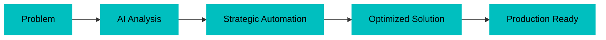

<div align="center">
  
[](https://git.io/typing-svg)

</div>

<div align="center">
  
  
  
</div>

---

## 🎯 About Me

> *Transforming ideas into scalable, efficient, and cost-effective solutions*
```typescript
const samyr = {
  role: "Full-Stack Developer",
  location: "Ilhéus, BA 🇧🇷",
  focus: ["Web Development", "Infrastructure", "AI Integration"],
  approach: "Problem-driven & production-oriented",
  languages: {
    native: "Portuguese (pt-BR)",
    fluent: "English (en-US)"
  },
  currentlyLearning: "Always something new 🚀",
  funFact: "I optimize code and infrastructure costs equally"
};
```

### 💡 What I Bring to the Table

<table>
  <tr>
    <td align="center" width="50%">
      
      <br><b>Clean Code</b>
      <br>Practical debugging & efficient solutions
    </td>
    <td align="center" width="50%">
      
      <br><b>Infrastructure</b>
      <br>Deployment & optimization expertise
    </td>
  </tr>
  <tr>
    <td align="center" width="50%">
      
      <br><b>AI Integration</b>
      <br>Strategic automation & productivity
    </td>
    <td align="center" width="50%">
      
      <br><b>Cost-Aware</b>
      <br>Efficient architectures & resource optimization
    </td>
  </tr>
</table>

---

## 📊 GitHub Analytics

<div align="center">
  
  
</div>

<div align="center">
  
</div>

<div align="center">
  
</div>

<p align="center">
  
</p>

---

## 🛠️ Tech Arsenal

### 💻 Core Stack

<div align="center">


</div>

### 🏗️ Infrastructure & DevOps

<div align="center">


</div>

### 🎨 Frontend & Design

<div align="center">


</div>

### 🧰 Tools & Environment

<div align="center">


</div>

---

## 🤖 AI & Automation Approach

<div align="center">


</div>

**Strategic Focus:**
- 🎯 AI-assisted software development
- 🏛️ System architecture analysis
- ⚡ Task automation & workflow optimization
- 💰 Cost-efficiency considerations (tokens, context, latency)

---

## 🎓 Professional Philosophy

<div align="center">

| Value | Description |
|:-----:|:------------|
| ⚡ **Efficiency** | Delivering maximum value with optimal resource usage |
| 🎯 **Autonomy** | Self-driven learning and problem-solving |
| 📈 **Growth** | Continuous improvement and skill expansion |
| 🏆 **Quality** | Production-ready code and robust solutions |

</div>

---

## 📫 Let's Connect!

<div align="center">

[](https://linkedin.com/in/samyrmarjoub)
[](https://github.com/SamyrMarjoub)
[](mailto:your.email@example.com)

</div>

---

<div align="center">
  
### 💭 *"Code is like humor. When you have to explain it, it's bad."* – Cory House

**Thanks for visiting! Feel free to explore my repositories and don't hesitate to reach out!** 🚀

</div>


